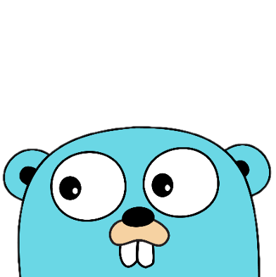

# Hey there! I'm StellarisW 

Go后端开发工程师

- 🔭 I’m currently ~~working~~ studying in **Chongqing**.
- 🌱 I’m currently learning **Web Development** **distributed** , **micro service** and **big data**.
- 💬 Ask me about C++ , Golang technology.
- ⚡ Fun fact: 
  - Write technical and life articles.
  - “Hardcore fiction reader”.
  - Play games, especially CSGO games.
  - Watch the game live.

## 🚀 Tech Stack:
- 💻       
  
  
  
  
  
    
-  &nbsp;&nbsp;&nbsp;&nbsp;&nbsp;&nbsp;
  
    
    
    
    
- 🌐 &nbsp;&nbsp;&nbsp;&nbsp;&nbsp;&nbsp;
  
  
  
- 🛢 &nbsp;&nbsp;&nbsp;&nbsp;&nbsp;&nbsp;
  
  
  
   
   
- ⚙️ &nbsp;&nbsp;&nbsp;&nbsp;&nbsp;&nbsp;
  
  
  
  
  
- 🔧 &nbsp;&nbsp;&nbsp;&nbsp;&nbsp;&nbsp;
  
  
  
  
  
## Repos

## Follow Me

<!-- 

 -->

## GitHub Infos

## Languages

## Activities

